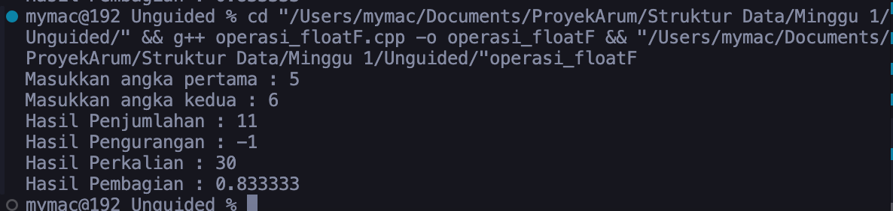
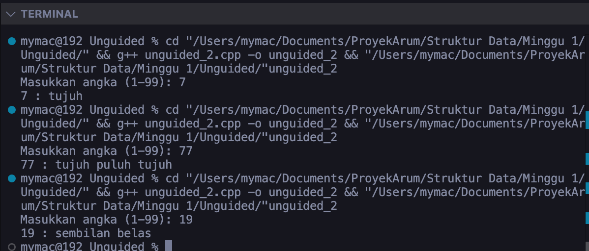
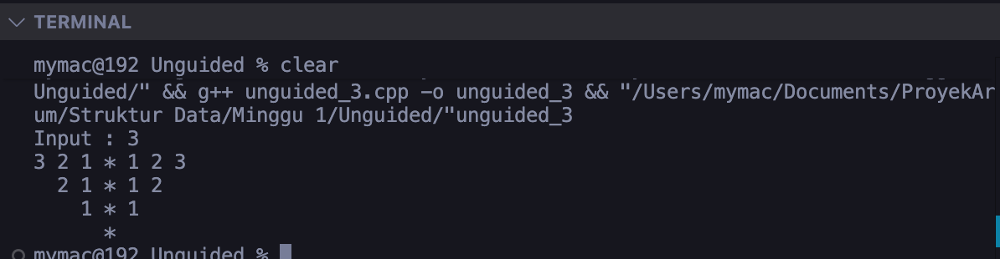

<h1 align = "center">Laporan Praktikum Modul 1<br>Codeblocks IDE & Pengenalan Bahas C++ (Bagian Pertama)</h1>
<p align="center">Dwi Okta Suryaningrum - 103112400066</p>
## Dasar Teori
___
Struktur Data adalah cara untuk membuat, menyimpan, mengatur, dan mengelola data sehingga dapat digunakan secara efisien[1]. Salah satu metode yang fleksibel untuk digunakan dalam pengolahan data dinamis adalah dengan metode Linked List. Linked List atau senarai berantai digunakan untuk menyimpan objek secara terurut sehingga memungkinkan penambahan, pengurangan, dan pencarian pada elemen data yang tersimpan secara efektif[2].

Linked List memiliki tiga jenis dalam penggunaannya, diantaranya yaitu :
#### Single Linked List
Single Linked List terdiri dari tiap-tiap node yang terdiri atas dua elemen. Dapat dikatakan Single Linked List atau Senarai Tunggal ketika struktur data sebuah node hanya memiliki satu tautan atas node berikutnya dalam sebuah seranai [3]. 

#### Double Linked List
Penggunaan Double Linked List hampir sama dengan penggunaan Single Linked List, hanya saja pada Double Linked List menerapkan sebuah pointer baru yang digunakan untuk menggeser mundur selain tetap mempertahankan pointer next.

#### Circular Linked List
Sebuah Single Linked List yang simpul terakhirnya menunjuk ke simpul awal dan simpul awalnya menunjuk ke simpul akhir atau seakan-akan membentuk sebuah lingkaran dengan titik awdan titik akhir yang saling bersebelahan[4].
___
## Guided
___
#### 1. Hello World
```C++

#include <iostream>
using namespace std;

int main(){
	int angka1, angka2; //deklarasi variabel
	cout << "Masukkan angka 1: ";
	cin >> angka1; //masukin input 1
	cout << "Masukkan angka 2: ";
	cin >> angka2; //masukin input 2

	if(angka1 <angka2){
		cout << angka1 << " kurang dari " << angka2 << endl;
	} else{
		cout << angka1 << " lebih dari " << angka2 << endl;
	}

	if(angka1 == angka2){
		cout << angka1 << " sama dengan " << angka2 << endl;
	} else if(angka1 != angka2){
		cout << "angka berbeda" << endl;
	}

  
	int pilihan;
	cout << "MENU" << endl;
	cout << "1. Penjumlahan" << endl;
	cout << "2. Pengurangan" << endl;
	cout << "Masukkan pilihan : " << endl;
	cin >> pilihan;

	int penjumlahan = angka1 + angka2;
	switch (pilihan){
		case 1:
			cout << "Hasil Penjumlahan: " << penjumlahan << endl;
			break;
		case 2:
			cout << "Hasil Pengurangan: " << angka1 - angka2 << endl;
			break;
		default:
			cout << "Pilihan salah" << endl;
			break;
	}
	return 0;
}

```
##### Penjelasan Singkat
 program ini berfungsi sebagai kalkulator sederhana yang alurnya sebagai berikut: 
 - Minta Input : pengguna memasukkan dua angka. 
 - Membandingkan : Program membandingkan kedua angka tersebut untuk menentukan mana yang lebih besar, lebih kecil, atau sama. 
 - Menampilkan Menu : Program menampilkan menu pilihan untuk melakukan penjumlahan atau pengurangan. 
 - Hitung dan Tampilkan : Berdasarkan pilihan pengguna, program menghitung hasilnya dan menampilkannya di layar.
#### 2. Aritmatika
``` C++
#include <iostream>
using namespace std;

int main(){
	int angka1, angka2; //deklarasi variabel
	cout << "Masukkan angka 1: ";
	cin >> angka1; //masukin input 1
	cout << "Masukkan angka 2: ";
	cin >> angka2; //masukin input 2

	cout << "Hasil Penjumlahan: " << angka1 + angka2 << endl;
	cout << "Hasil Pengurangan: " << angka1 - angka2 << endl;
	cout << "Hasil Perkalian: " << angka1 * angka2 << endl;
	cout << "Hasil Pembagian: " << angka1 / angka2 << endl;
	cout << "Sisa Bagi: " << angka1 % angka2 << endl;
	
	return 0;
}
```
##### Penjelasan singkat 
program sederhana yang berfungsi sebagai kalkulator dasar. Program ini akan meminta pengguna untuk memasukkan dua angka bulat, lalu secara otomatis akan menghitung dan menampilkan hasil dari lima operasi matematika dasar: penjumlahan, pengurangan, perkalian, pembagian, dan sisa bagi (modulus) dari kedua angka tersebut ke layar.
#### 3. Input/Output
``` C++
#include <iostream>

using namespace std; //biar simple biar ga nulis std::cout <<

int main(){
	int angka; //deklarasi variabel
	cout << "Masukkan angka: ";
	cin >> angka;
	cout << "Angka yang dimasukkan: " << angka << endl;
	
	return 0;
}
```
##### Penjelasan Singkat
Program ini untuk mengambil dan menampilkan kembali sebuah angka. Saat dijalankan, program akan meminta pengguna memasukkan satu angka bulat, kemudian angka yang dimasukkan tersebut akan disimpan dalam variabel bernama `angka`. Setelah itu, program akan langsung mencetak kembali angka tersebut ke layar dengan didahului teks "Angka yang dimasukkan: ".
#### 4. Loop
``` C++
#include <iostream>

using namespace std;

int main(){
	int angka1, angka2; //deklarasi variabel
	cout << "Masukkan angka 1: ";
	cin >> angka1; //masukin input 1
	
	for(int i = 0; i < angka1; i++){ //increment
		cout << i << " - " ;
	}

	cout << endl;

	int j = 10;
	while (j > angka1){ //decrement
		cout << j << " - ";
	j--;
	}

	cout << endl;
	
	int k = 10;
	do{
		cout << k << " - ";
		k++;
	} while (k < angka1);

return 0;
}
```
##### Penjelasan Singkat
program ini bertujuan untuk **mendemonstrasikan tiga jenis perulangan (loop) dasar** dalam C++. Setelah meminta satu angka dari pengguna, program ini menggunakan:

1. **`for`**: Untuk mencetak deret angka yang menaik (increment).
2. **`while`**: Untuk mencetak deret angka yang menurun (decrement).
3. **`do-while`**: Untuk menunjukkan perulangan yang pasti berjalan minimal satu kali.
#### 5. Struct
``` C++
#include <iostream>

using namespace std;

int main(){
	const int MAX = 5;
	struct rapot{
		char nama[5];
		float nilai;
	};
	rapot siswa[MAX];

	for(int i = 0; i < MAX; i++){
		cout << "Masukkan nama siswa: ";
		cin >> siswa[i].nama;
		cout << "Masukkan nilai siswa: ";
		cin >> siswa[i].nilai;
		cout << endl;
	}

	int j = 0;
	while(j < MAX){
		cout << "Nama siswa: " << siswa[j].nama << " ,Nilai siswa: " << siswa[j].nilai << endl;
	j++;
	}
	return 0;
}
```
##### Penjelasan Singkat 
Program ini untuk **mendemonstrasikan cara kerja `struct`** di C++. Sebuah `struct` bernama `Mahasiswa` dibuat sebagai "cetakan" untuk menyimpan data yang saling berhubungan, yaitu `nim` dan `nama`. Kemudian, program membuat satu variabel `mhs` dari cetakan tersebut, mengisinya dengan data NIM dan Nama, lalu menampilkannya kembali ke layar.
## Unguided
___
#### 1. Buatlah program yang menerima input-an dua buah bilangan betipe float, kemudian memberikan output-an hasil penjumlahan, pengurangan, perkalian, dan pembagian dari dua bilangan tersebut.
```C++

#include <iostream>

using namespace std;

//fungsi

float penjumlahan(float x, float y){
	return x + y;
}

float pengurangan(float x, float y){
	return x - y;
}

float perkalian(float x, float y){
	return x * y;
}

float pembagian(float x, float y){
	return x / y;
}

int main(){
	float a, b;

	//inputan
	cout << "Masukkan angka pertama : ";
	cin >> a;
	cout << "Masukkan angka kedua : ";
	cin >> b;
	
	cout << "Hasil Penjumlahan : " << penjumlahan(a,b) << endl;
	cout << "Hasil Pengurangan : " << pengurangan(a,b) << endl;
	cout << "Hasil Perkalian : " << perkalian(a,b) << endl;
	cout << "Hasil Pembagian : " << pembagian(a,b) << endl;
	
	return 0;
}

```
##### Output 1
>

##### Penjelasan Unguided 1
Program ini menggunakan fungsi terpisah untuk setiap operasi hitung (tambah, kurang, kali, bagi). Fungsi main() sekarang tugasnya lebih sederhana yaitu hanya mengambil input angka dari pengguna, lalu langsung memanggil fungsi yang sesuai untuk menampilkan hasilnya. 

### 2. Buatlah sebuah program yang menerima masukan angka dan mengeluarkan output nilai angka tersebut dalam bentuk tulisan. Angka yang akan di- input-kan user adalah bilangan bulat positif mulai dari 0 s.d 100
```C++
#include <iostream>
using namespace std;

//satuan
string satuan(int x){
	if (x == 0) {
		return "nol";
	} else if (x == 1) {
		return "satu";
	} else if (x == 2) {
		return "dua";
	} else if (x == 3) {
		return "tiga";
	} else if (x == 4) {
		return "empat";
	} else if (x == 5) {
		return "lima";
	} else if (x == 6) {
		return "enam";
	} else if (x == 7) {
		return "tujuh";
	} else if (x == 8) {
		return "delapan";
	} else if (x == 9) {
		return "sembilan";
	} else {
		return "";
	}
}

//belasan
string belasan(int x){
	if (x > 10 && x < 20) {
		return "belas";
	} else {
		return "";
	}
}

//puluhan
string puluhan(int x){
	if (x >= 20 && x < 100) {
		return "puluh";
	} else {
		return "";
	}
}

int main(){
	int angka;
	string hasil;
	
	cout << "Masukkan angka (1-99): ";
	cin >> angka;
	
	if (angka < 0 || angka > 100) {
		cout << "Angka di luar jangkauan!" << endl;
		return 0;
	} else if (angka >= 0 && angka < 10) {
		if (angka == 0){
			hasil = "nol";
		} else {
			hasil = satuan(angka);
		}
	} else if (angka == 10){
		hasil = "sepuluh";
	} else if (angka == 11){
		hasil = "sebelas";
	} else if (angka >= 12 && angka < 20){
		hasil = satuan(angka % 10) + " " + belasan(angka);
	} else if (angka >= 20 && angka < 100){
		hasil = satuan(angka / 10) + " " + puluhan(angka) + " " + satuan(angka % 10);
	} else if (angka == 100){
		hasil = "seratus";
	}
	
	cout << angka << " : " << hasil << endl;
}
```
##### Output 2
>

##### Penjelasan Unguided 2
Ada tiga fungsi. Satu buat ngasih nama angka **satuan** (1-9), dua lagi cuma buat nyediain kata **"belas"** dan **"puluh"**. Fungsi main() tugasnya
- Minta user nginputin angka
- Di cek apakah angka yang diinputkan user ini puluhan, belasan, atau satuan.
- Kalau angkanya **77**, dia pecah jadi **7** dan **7**. Dia ambil kata "tujuh" dari fungsi, tambahin kata "puluh", terus ambil kata "tujuh".
- Hasilnya digabungin jadi "tujuh puluh tujuh" terus ditampilin.

### 3. Buatlah program yang dapat memberikan input dan output sbb.
```C++
#include <iostream>
using namespace std;

int main() {
	int x;
	
	cout << "Input : ";
	cin >> x;
	
	for (int i = x; i >= 1; i--) {
		for (int s = 0; s < x - i; s++) {
			cout << " ";
		}
		
		for (int j = i; j >= 1; j--) {
			cout << j << " ";
		}
		
		cout << "* ";

		for (int k = 1; k <= i; k++) {
			cout << k << " ";
		}
		
		cout << endl;
	}
	for (int s = 0; s < x * 2; s++) {
		cout << " ";
	}
	cout << "*" << endl;
	
	return 0;
}
```
##### Output 3
>
##### Penjelasan Unguided 3
Program ini intinya kayak lagi ngegambar sebuah pola piramida angka pakai teks, baris demi baris dari atas ke bawah. Untuk setiap baris, dia melakukan ini: 
- Geser ke kanan pakai spasi biar bentuknya miring kayak segitiga. 
- Tulis angka hitung mundur (contoh: 3 2 1). 
- Kasih bintang * di tengah. Tulis angka hitung maju (contoh: 1 2 3). 
- Setelah semua baris angka selesai, dia tinggal nambahin satu baris terakhir yang isinya cuma bintang biar polanya pas.

___
## Kesimpulan
Pada praktikum kali ini, materi yang dibahas adalah pengenalan dasar-dasar bahasa pemrograman C++, meliputi penggunaan **IDE Code::Blocks**, **struktur dasar program**, **variabel**, **tipe data**, **operator**, serta **logika kondisional** dan **perulangan**. Dari praktikum ini, dapat disimpulkan bahwa:

1. Pemahaman terhadap **tipe data** yang tepat, seperti `float` untuk bilangan desimal dan `int` untuk bilangan bulat, sangat penting agar program dapat mengolah data sesuai dengan yang diharapkan.
2. Penggunaan **fungsi** memungkinkan program untuk dipecah menjadi bagian-bagian yang lebih kecil dan spesifik. Hal ini membuat kode menjadi lebih **terstruktur**, **rapi**, dan **mudah dikelola**, seperti yang ditunjukkan pada program kalkulator sederhana.
3. Logika **kondisional `if-else`** merupakan alat yang sangat efektif untuk menangani berbagai macam kasus atau aturan yang berbeda. Pada program konversi angka ke teks, `if-else` digunakan untuk membedakan perlakuan terhadap angka satuan, belasan, dan puluhan.
4. Struktur **perulangan bersarang (nested loop)**, seperti `for` di dalam `for`, dapat dimanfaatkan untuk membuat pola visual yang kompleks, seperti pola piramida angka. Dengan mengatur variabel kontrol pada setiap _loop_, kita bisa mengendalikan pencetakan karakter spasi, angka, dan simbol secara presisi baris demi baris.
___
## Referensi
[1] Astuti, I. K. (2019, March 30). STRUKTUR DATA LINKED LIST. https://doi.org/10.31219/osf.io/8pj27
[2] P. Setialana, “Analisis Kecepatan Struktur Data Linked List Dan Tree,” no. February, 2016, doi: 10.13140/RG.2.1.1243.8801.
[3] Siregar, A. A. N. (2019, April 25). Pengertian Linked Object. https://doi.org/10.31219/osf.io/dmwr3
[4] Arraffi, A. (2019, March 30). PENGERTIAN LINIER DALAM STRUKTUR DATA MAJEMUK. https://doi.org/10.31219/osf.io/sczvp